# Инструкция

## Подготовка

- Включите робота
- Вставьте Ethernet
- Откройте параметры адаптера

    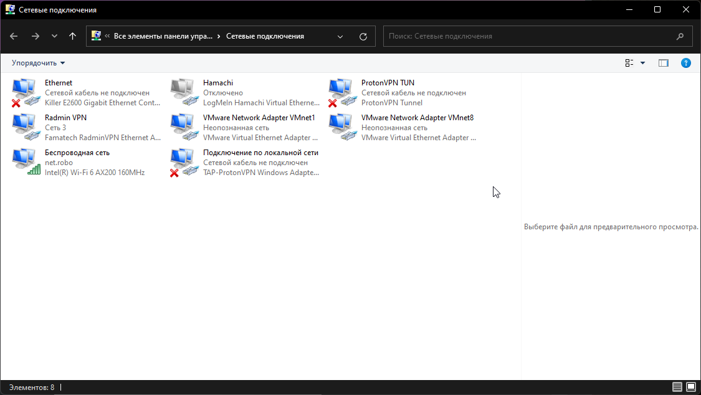

- Нажмите правой кнопкой мыши по адаптеру *Ethernet*

    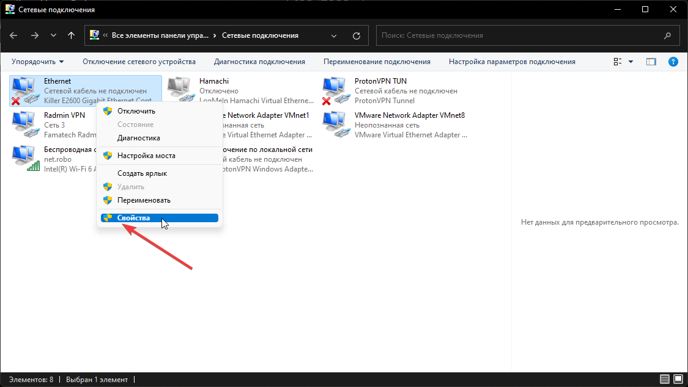

- Потом нажмите на IP версии 4

    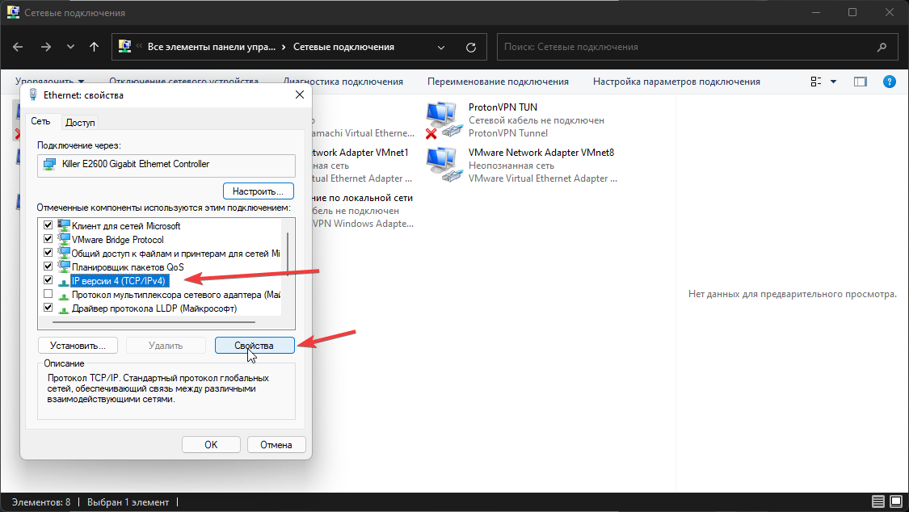

- Введите всё как показано на скриншоте

    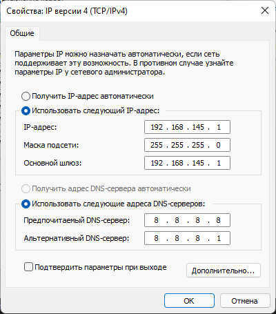

- И нажмите ок если вылезет что то ещё нажмите ок
- Всё готово к запуску

- Нажмите *Win+R*
- У вас откроется окно *Выполнить.* Введите `cmd` , как показано на скриншоте

    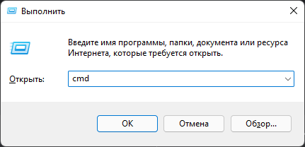

- Нажмите *ОК*. Откроется командная строка.

    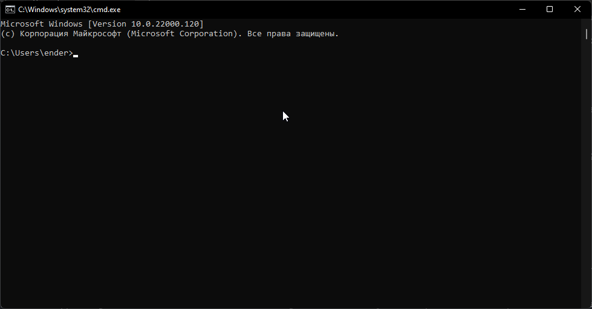

- Введите ```ssh pi@raspberrypi```

    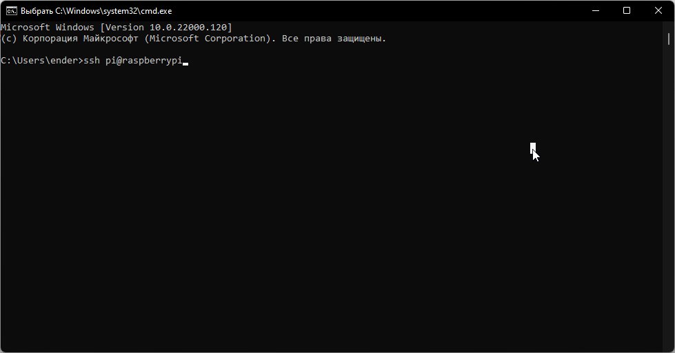

- Нажмите *Enter*

    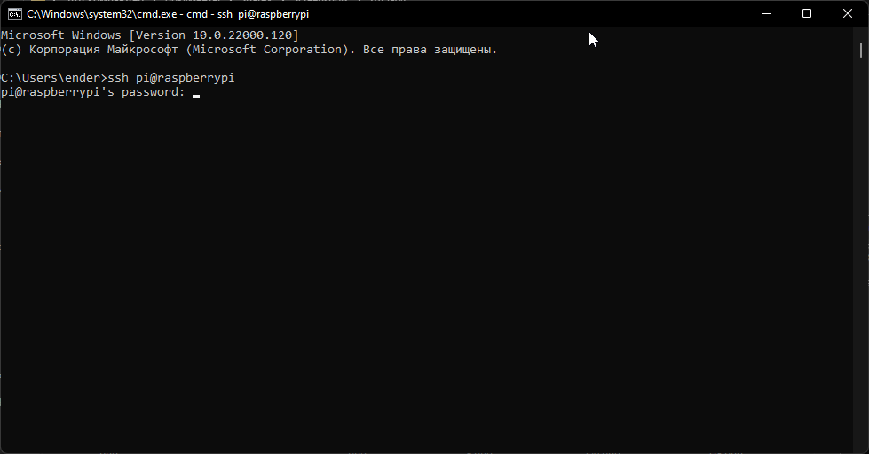

- Введите ```raspberry``` и нажмите *Enter*

    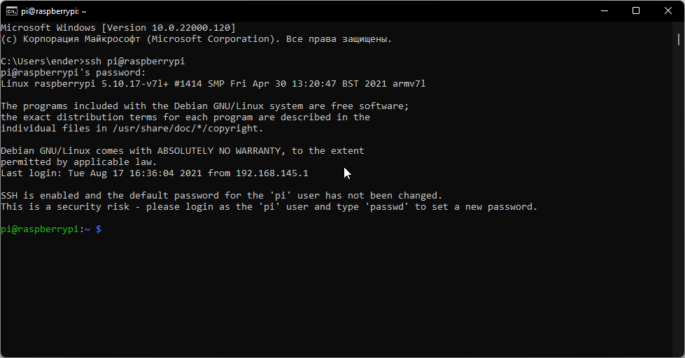

- Введите ```cd TrumpetHoler/src/server``` и нажмите *Enter*

    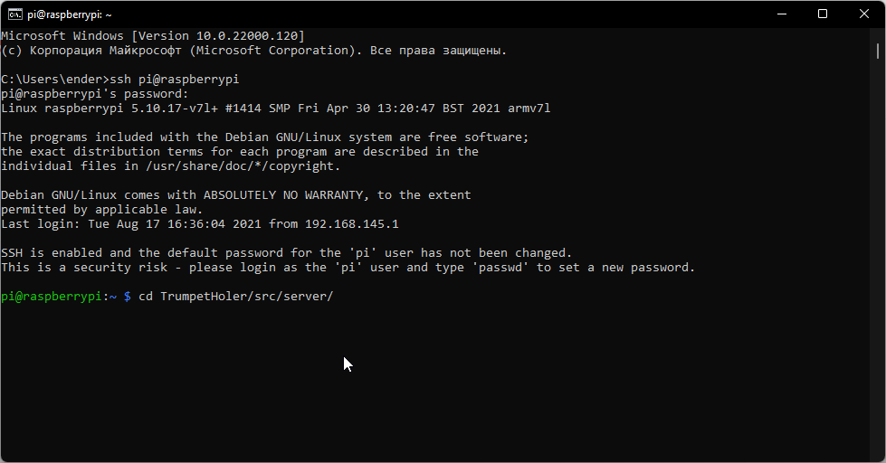

    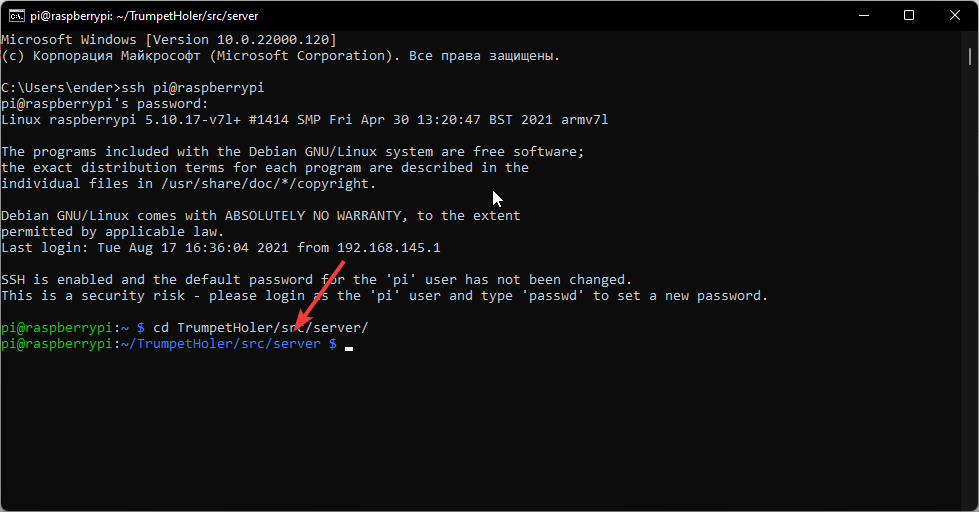

- Введите ```python3 main.py --port /dev/ttyACM0 --cam /dev/video0 --cam1 /dev/video``` и нажмите TAB (x3), и вы увидите все камеры далее вам нужно перебрать все (выбирать камеру нажимать Enter и проверять в программе если не работает вернитесь в консоль и нажите *Ctrl+C* (x2) и программа выйдет нажмите стрелку вверх и смените ID камеры)

    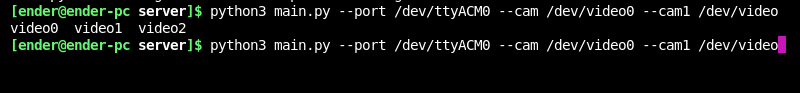

- Всё готово, если возникнет ошибка, то перезагрузите робота, а после перейдите к пункту 4
- Теперь необходимо установить программу. Скачайте [программу от сюда](https://drive.google.com/file/d/1t-_TPyB-bFky28sUrci8jVrmXV0865e-/view)
- Запустите её, откроется такое окно 

    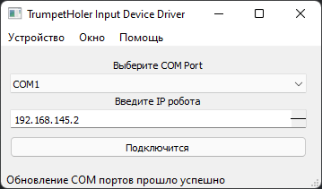

- Не пугайтесь открытой консоли
- Выберите нужный COM порт и нажмите подключится
- Всё готово. Если возникнет ошибка, то перезагрузите робота и перейдите к пункту 4
- Теперь откройте [сайт](https://github.com/RoboGradeIndustriesTeam/TrumpetHoler/actions/workflows/zip_upload.yml) и выбирете последний пункт (нажмите на текст)

    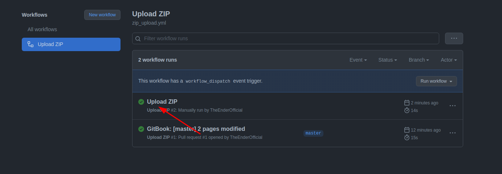 

- Далее на страницы нажмите кнопку *Archive* именно на текст

    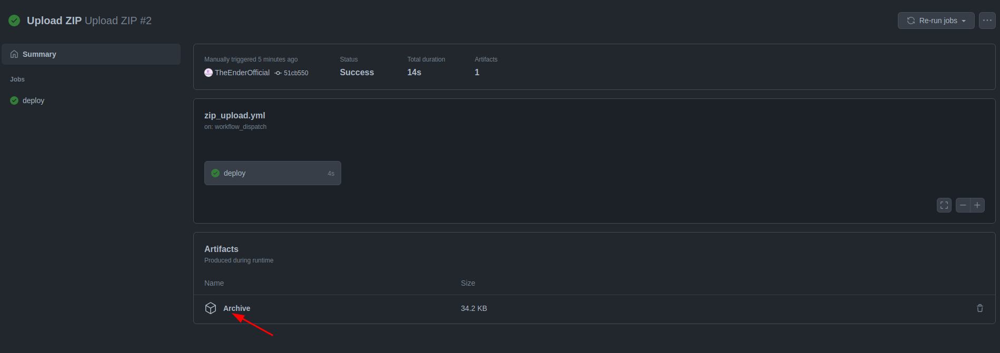 

- У вас скачается архив распакуйте архив в любую папку

    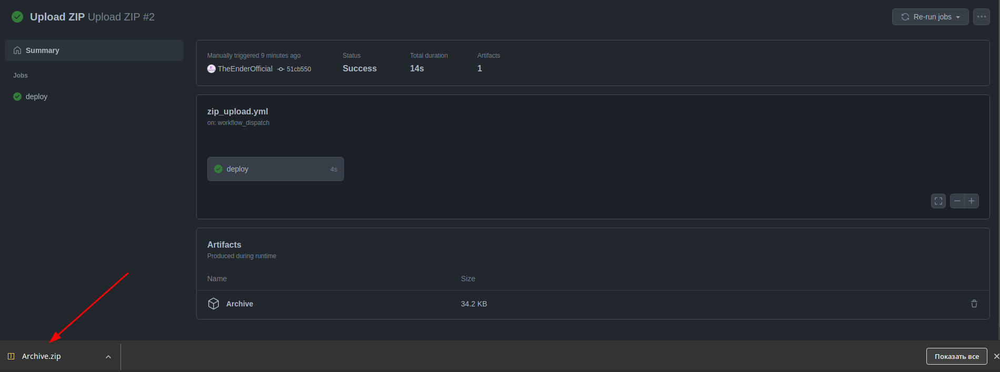
    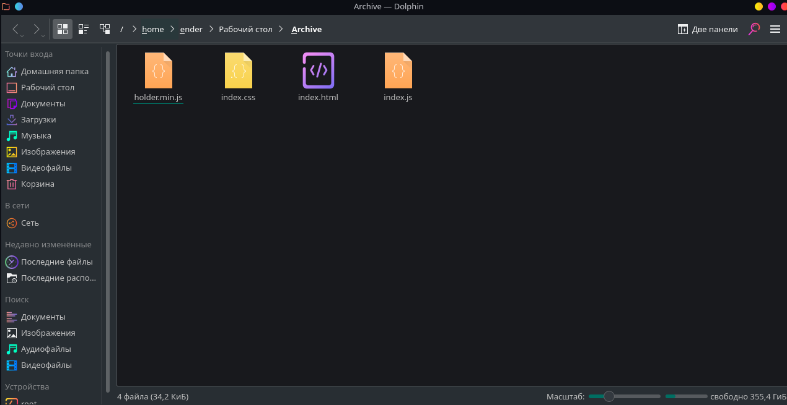

- Потом откройте файл ```index.html``` в браузере

    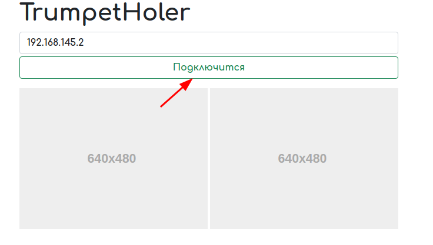

- Нажмите *Подключится*
- Робот запущен
