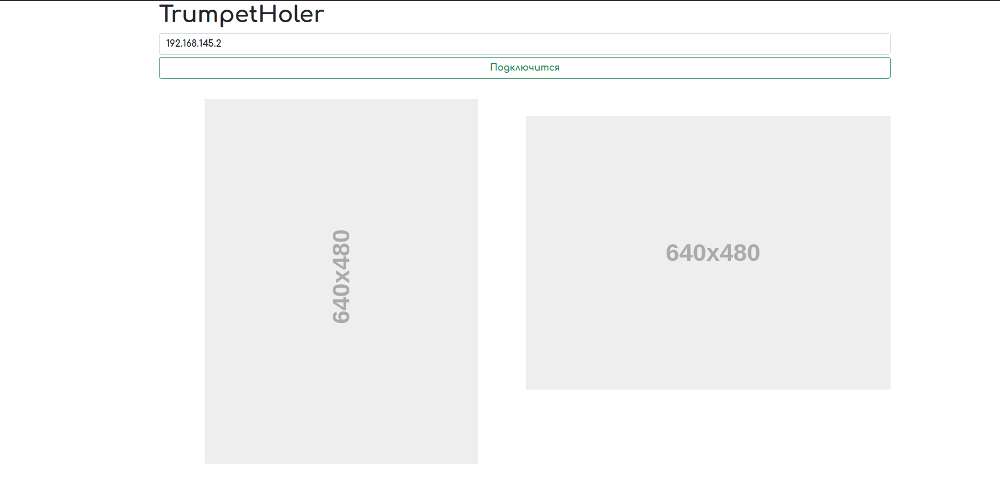

# Инструкция

## Подготовка

- Включите робота
- Вставьте Ethernet
- Откройте параметры адаптера

    

- Нажмите правой кнопкой мыши по адаптеру *Ethernet*

    

- Потом нажмите на IP версии 4

    

- Введите всё как показано на скриншоте

    

- И нажмите ок если вылезет что то ещё нажмите ок
- Всё готово к запуску
- Теперь необходимо установить программу. Скачайте [программу от сюда](https://drive.google.com/file/d/1t-_TPyB-bFky28sUrci8jVrmXV0865e-/view)
- Запустите её, откроется такое окно 

    

- Не пугайтесь открытой консоли
- Выберите нужный COM порт и нажмите подключится
- Всё готово. Если возникнет ошибка, то перезагрузите робота и перейдите к пункту 4
- Теперь откройте [сайт](https://github.com/RoboGradeIndustriesTeam/TrumpetHoler/actions/workflows/zip_upload.yml) и выбирете последний пункт (нажмите на текст)

     

- Далее на страницы нажмите кнопку *Archive* именно на текст

     

- У вас скачается архив распакуйте архив в любую папку

    
    

- Потом откройте файл ```index.html``` в браузере

    

- Нажмите *Подключится*
- Робот запущен
